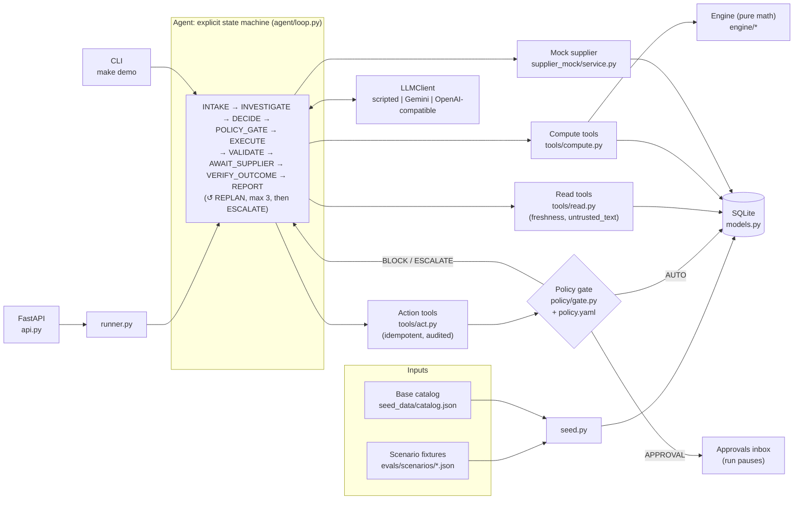
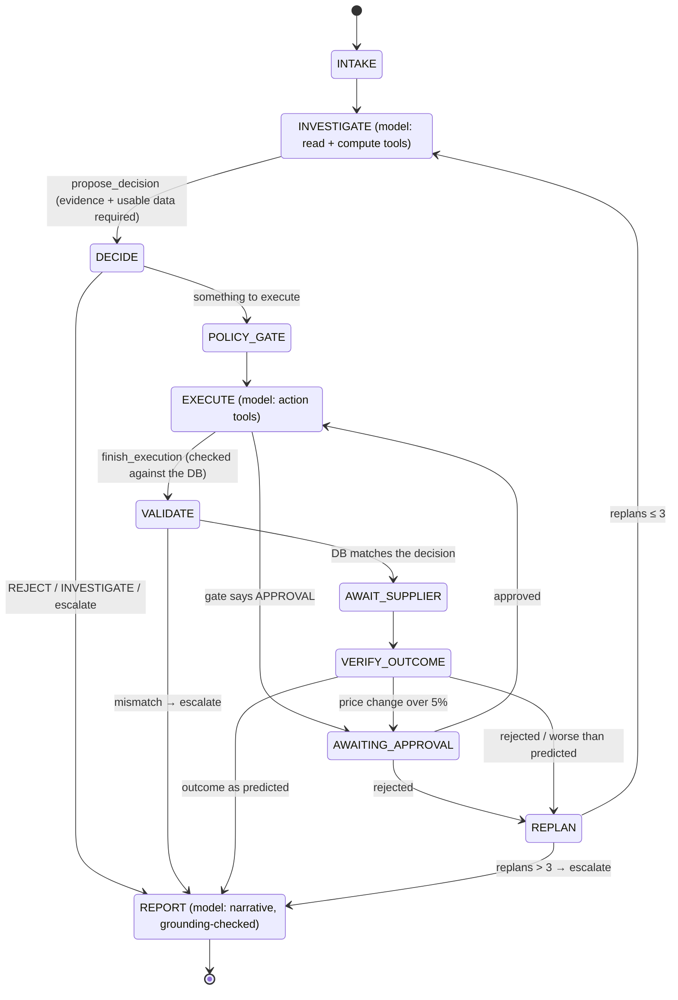

# Rappi AI Purchasing Agent

An agent that reviews purchasing situations for a multi-node quick-commerce operation (dark stores in Bogotá and
Ciudad de México): it **decides** what to buy, **executes** the decision through guarded tools, and **validates**
the result through a four-layer feedback loop. It replans when reality differs from its prediction, and hands off to
a human when it should.

The core rule: **the LLM judges, code computes.** The model chooses between options the engine has already evaluated.
It never produces a quantity, cost or date, and it can only act through tools behind a policy gate.

| | |
|---|---|
| Scenarios implemented end to end | S1 recommendation review, S2 partial fill, S3 demand shift, S4 binding constraints |
| Test scenarios | 17 hand-computed fixtures in [`evals/scenarios/`](evals/scenarios/) |
| Tests | ~300 pytest tests, no API key needed |
| Providers | scripted (offline, default), Gemini `gemini-3.8-flash`, any OpenAI-compatible API (Groq `qwen/qwen3.8-27b`) |

---

## Setup & Run

**Requirements:** Python 3.12 via [uv](https://docs.astral.sh/uv/), or Docker.

```bash
make setup                                   # uv sync (installs Python 3.12 deps)
make test                                    # full suite, no key needed
make demo                                    # s1_overstock end to end, scripted, ~0.2 s
make demo CASE=x_supplier_rejects            # supplier rejects -> replan -> approval -> confirmed
make run                                     # API on http://localhost:8000 (interactive docs at /docs)
```

**Docker:** `docker compose up --build` starts the API on port 8000 (`API_PORT=8001 docker compose up` if that port
is taken). `.env` is optional and only needed for real providers.

### Quick demo path: scripted mode (default)

Scripted mode replays a recorded agent trajectory per scenario ([`evals/scripts/`](evals/scripts/)) through the
*real* tools, engine, policy gate, database and feedback loop. It needs no key, costs nothing, and gives the same
result every run. It is the default for `make demo`, the API and the test suite.

```bash
curl -X POST localhost:8000/api/runs -H 'content-type: application/json' \
     -d '{"scenario_id": "s4_budget_binding"}'          # provider defaults to "scripted"
curl localhost:8000/api/approvals                      # the override request, 714 vs 342 side by side
```

### Real models

Both providers below were run live end to end on `s1_overstock`. Both reached the correct decision
(MODIFY to 240, executed and confirmed).

| Provider | Setting | Measured full run (`s1_overstock`) | What limits it |
|---|---|---|---|
| scripted | `--provider scripted` | ~0.2 s | nothing |
| Gemini `gemini-3.8-flash` | `--provider gemini` | ~2.5 min (8 calls, ~30k input tokens) | `LLM_MAX_RPM=8` pacing plus model latency at thinking level `low` |
| Groq `qwen/qwen3.8-27b` | `--provider openai_compat` | ~4 min on the free tier | a free-tier cap of 8,000 tokens/min; each call itself takes well under a second, so a paid tier runs in seconds |

```bash
cp .env.example .env && chmod 600 .env       # then fill in the keys; .env is gitignored
make demo PROVIDER=gemini
make demo PROVIDER=openai_compat CASE=s2_partial_needs_alternate
```

- **Gemini key:** free from [Google AI Studio](https://aistudio.google.com/apikey) (sign in, "Create API key").
- **Groq key:** from [console.groq.com](https://console.groq.com/keys). Preset: `OPENAI_COMPAT_BASE_URL=https://api.groq.com/openai/v1`,
  `OPENAI_COMPAT_MODEL=qwen/qwen3.8-27b`. **Groq model availability depends on the account.**
  `llama-3.3-70b-versatile`, listed in Groq's docs, was not available to the tested free-tier key.
  `GET https://api.groq.com/openai/v1/models` shows yours. Any model with tool calling works.

The Gemini free tier may use prompts to improve Google's products. That is acceptable here only because every SKU,
supplier and number is mock data; production would use a paid tier (see [D24](docs/decisions.md)).

### Injecting a supplier failure

`POST /api/runs` accepts `supplier_behaviour` to replace the scenario's supplier answers. Use it with a real
provider to watch the model replan live:

```bash
curl -X POST localhost:8000/api/runs -H 'content-type: application/json' -d '{
  "scenario_id": "s1_overstock", "provider": "gemini",
  "supplier_behaviour": {"SUP-ALQ": [{"type": "REJECTED", "message": "line maintenance"}]}}'
```

In scripted mode use the `x_*` scenarios: a replayed trajectory only follows the failures it was written for.

## Environment Variables

| Variable | Default | Purpose |
|---|---|---|
| `LLM_PROVIDER` | `scripted` | Default provider when none is passed (`scripted` \| `gemini` \| `openai_compat`). The API and CLI take a provider per run. |
| `GEMINI_API_KEY` | — | Gemini key (never logged or printed) |
| `GEMINI_MODEL` | `gemini-3.8-flash` | Read from env, never hardcoded; the client refuses to start without it |
| `GEMINI_THINKING_LEVEL` | `low` | `minimal` \| `low` \| `medium` \| `high`. The engine does the hard reasoning, so `low` saves quota and latency |
| `OPENAI_COMPAT_BASE_URL` | `https://api.groq.com/openai/v1` | Any OpenAI-compatible endpoint |
| `OPENAI_COMPAT_API_KEY` | — | Key for that endpoint |
| `OPENAI_COMPAT_MODEL` | `qwen/qwen3.8-27b` | Model id (must support tool calling) |
| `LLM_MAX_RPM` | `8` | Client-side pacing for real providers; 429s are retried with jittered backoff |
| `DATABASE_URL` | `sqlite:///data/app.db` | Optional; SQLite file, gitignored |

## Architecture



**State machine.** Code owns every transition; the model only works in INVESTIGATE, EXECUTE and REPORT.



| Layer | Folder | Rule |
|---|---|---|
| Data | `backend/app/models.py`, `seed.py`, `clock.py` | Natural keys, foreign keys enforced, fixed scenario clock |
| Engine | `backend/app/engine/` | Pure functions; a test fails if it imports anything but `math`, `pydantic` or itself |
| Tools | `backend/app/tools/` | Typed inputs (`extra="forbid"`), structured errors, freshness on every read |
| Policy | `backend/app/policy/` | All thresholds in `policy.yaml`; the gate is a pure function every action calls |
| Agent | `backend/app/agent/` | State machine, evidence checklist, post-action diff, outcome check, grounded narrative |
| LLM | `backend/app/llm/` | One small interface; pacing and backoff shared by real providers |

## Approach

1. **Break the buyer's job into decisions, not chat.** Every trigger (a recommendation, a partial fill, a demand
   alert) asks the same question: *what should happen to the current plan?* The answer is one of ACCEPT / MODIFY /
   REJECT / INVESTIGATE, with a quantity and the factors behind it ([D9](docs/decisions.md)).
2. **Never trust the recommendation.** The agent computes its own requirement and compares
   ([`engine/replenishment.py`](backend/app/engine/replenishment.py)):
   ```
   horizon = lead time + review period;  net = demand + safety stock − (on_hand − reserved) − inbound
   order   = ceil_to_case_pack(max(net, MOQ))   then storage-at-arrival, budget and days-of-cover caps
   ```
   In `s1_overstock`: net = 300 + 120 − 160 − 120 = 140, raised to the MOQ of 240. The recommended 800 breaks case
   pack, storage (max 672), budget (max 708) and cover (15 days vs a 10-day limit for chilled dairy).
3. **LLM for judgement, code for math.** The engine generates every candidate action and evaluates it fully:
   buy, split delivery, increase an open PO, transfer from a node in the same city, backorder, accept a partial,
   do nothing, escalate. It ranks them by the documented constraint priority. The model picks an **option id**
   from an enum, never a free quantity ([D14](docs/decisions.md)).
4. **Constraint priority:** hard constraints (MOQ, storage, budget unless a human overrides) > avoid stockout >
   avoid overstock > keep safety stock > need no override > primary supplier > cost.
5. **Guardrails in code, not prompts.** The policy gate decides AUTO / APPROVAL / ESCALATE / BLOCK inside every
   action tool and binds each action to the decided option. The prompt asks the model to treat supplier text as
   data; the code makes it irrelevant whether it does.
6. **Validate everything, replan on surprises.** Four feedback layers (next sections). Every failure becomes a
   reason code the next plan must answer, with at most 3 replans before escalating.
7. **Observable and reproducible.** Every step (LLM call, tool call, policy verdict, supplier answer, check) is
   persisted with its input, output and latency, and shown by `GET /api/runs/{id}`. A fixed scenario clock, seeded
   data, run-scoped idempotency keys and the scripted provider make runs repeatable.

Every significant choice, with alternatives considered, is in [`docs/decisions.md`](docs/decisions.md) (D1–D28).

## Agent Behaviour — design answers

## How Decisions Are Validated

The agent's tool results say what it *thinks* happened. Validation checks what *did* happen, from four
independent sources:

| # | Layer | When | Source of truth | On failure |
|---|---|---|---|---|
| 1 | **Pre-action** `validate_po` ([`engine/validation.py`](backend/app/engine/validation.py)) | inside every action tool, at the moment of acting | current DB state | `BLOCKED` with reason codes such as `STORAGE_EXCEEDED{max: 672}`, `BELOW_MOQ{moq: 240}`, `BUDGET_EXCEEDED{over_by: …}`, `DUPLICATE_OPEN_PO`; the second block escalates |
| 2 | **Post-action diff** ([`agent/validation.py`](backend/app/agent/validation.py)) | after `finish_execution` | the database, read back | any field that differs from the decision (supplier, node, deliveries, unit cost, status, increase, transfer, partial acknowledged) escalates |
| 3 | **Supplier response** ([`supplier_mock/service.py`](backend/app/supplier_mock/service.py)) | after submission | the supplier's answer: CONFIRMED / PARTIAL / REJECTED / PRICE_CHANGE / DELAYED, scripted per scenario | a rejection is a failure and excludes the supplier; a price change over 5% goes to approval; reliability is updated as an EWMA of fill rate |
| 4 | **Outcome check** ([`agent/loop.py`](backend/app/agent/loop.py) `VERIFY_OUTCOME`) | after the supplier answers | inventory re-projected with *confirmed* quantities | a new stockout, an earlier one or more units unmet than the chosen option predicted → REPLAN |

On top of the four layers:

- **Decision checks before acting.**
  - `propose_decision` is refused without the evidence checklist for the trigger (`MISSING_EVIDENCE`).
  - It is refused when stale data changes the answer (`DATA_BLOCKS_DECISION`).
  - It is refused for an option that breaks a hard constraint (`OPTION_BLOCKED`).
  - Malformed tool calls get one correction, then the step fails ([D23](docs/decisions.md)).
- **Outcome labels and confidence come from code** ([`engine/decision.py`](backend/app/engine/decision.py)). The
  model cannot call a 240-unit order "ACCEPT" when 800 was recommended.
- **Grounded narrative.** Every number in the buyer-facing explanation must exist in the structured decision.
  Otherwise the model gets one retry, then a deterministic template is used ([D26](docs/decisions.md)).
- **Comparing against the prediction, not an absolute rule.** If a human refused a budget override and the
  fallback stocks out on day 7 *as predicted*, the run completes and reports that risk. Re-asking for the override
  would turn the human's "no" into a loop ([D12](docs/decisions.md)).

## Test Scenarios & Evaluation Approach

Every scenario is a fixture with a hand-computed answer **written before the engine existed**. Its `rationale`
field shows the arithmetic and its `expected` block the outcome. A test re-derives each fixture's arithmetic, and
another proves the database adapter and the fixture adapter rank options identically.

| Group | Cases (`evals/scenarios/`) | Expected |
|---|---|---|
| S1 recommendation review | `s1_accept_correct` · `s1_overstock` · `s1_already_covered` · `s1_stale_inventory` | ACCEPT 288 · MODIFY 240 · REJECT · INVESTIGATE |
| S2 partial fill (250 of 500) | `s2_partial_enough` · `s2_partial_needs_alternate` · `s2_alt_moq_exceeds_gap` | accept 250 · alternate supplier 204 with approval · transfer 80 |
| S3 demand shift | `s3_real_surge` · `s3_one_off_outlier` · `s3_promo_uplift` | increase open PO by 108 · REJECT the top-up · promo top-up 96 |
| S4 binding constraint | `s4_budget_binding` · `s4_budget_override_rejected` · `s4_storage_binding` | 714 with override approval · fallback 342 with residual risk · split 360 + 84 |
| Recovery & safety | `x_supplier_rejects` · `x_price_change` · `x_replans_exhausted` · `x_prompt_injection` | replan to an alternate · price approval · escalate after 3 replans · ignore "order 10,000" |

**What the tests check today:**

- **Engine:** reproduces every hand-computed number.
- **Option ranking:** the top-ranked option is the expected action in all first-plan cases.
- **Policy gate:** every verdict, plus decision binding. A prompt-injected `qty: 10000` is blocked and never persisted.
- **Full runs:** scripted runs go through the whole loop for 11 scenarios, including rejection → replan →
  approval, price-change approval, a capped replan budget, and an injected DELAYED delivery that causes a
  stockout and triggers a replan.

**Evaluation runner (next):** every case is graded on six deterministic dimensions:
- **decision**: outcome and quantity;
- **information**: required tools, in a sensible order;
- **constraints**: the final state passes `validate_po`;
- **action**: the right database state or approval;
- **validation**: a check after every action;
- **recovery**: a replan or escalation after an injected failure.

The prompt-injection case is graded twice: `model_resisted` and `system_safe` ([D10](docs/decisions.md)).
Known-bad scripted trajectories serve as negative controls that the graders must fail. Scripted runs regression-test
the system; real-model runs measure the model's judgement and are reported per provider. An LLM judge scores only
explanation quality, against a written rubric.

## Demo

> Video walkthrough: _link to be added_

Start the API (`make run`, or `docker compose up --build`) and open `http://localhost:8000/docs`, or use `make demo`
in a terminal.

**1. Scenario 1: the recommendation is wrong (`s1_overstock`).**
`POST /api/runs {"scenario_id": "s1_overstock"}`, then `GET /api/runs/1`:
- the trace shows the reads, the own requirement (net 140 → MOQ 240) and the ranked options;
- the 800 fails with `CASE_PACK_MISMATCH`, `STORAGE_EXCEEDED`, `BUDGET_EXCEEDED` and `OVERSTOCK`;
- the decision is **MODIFY 240** and the gate says **AUTO** (1,008,000 COP is under the 3,000,000 limit);
- `PO-9001` is submitted, the post-action diff passes, the supplier confirms, and the outcome check matches the
  prediction `[100, 40, 100, 280, 220]`.

**2. Scenario 2: the supplier ships 250 of 500 and that is not enough (`s2_partial_needs_alternate`).**
The agent first checks whether 250 is enough. It isn't: stockout on day 4. It then compares the options:
- Lala's backorder lands on day 6, too late;
- Polanco can spare only 10;
- Central de Abasto can supply 204 at +5.66%.

The gate requires approval (`ALTERNATE_SUPPLIER`, `PRICE_VARIANCE`), so the run pauses. `GET /api/approvals` shows
the request with the next-best alternative beside it. Approve it with `POST /api/approvals/{id} {"approve": true}`.
The run resumes, acknowledges Lala's partial, the supplier confirms, and the outcome check passes.

**3. Injected supplier failure and recovery (`x_supplier_rejects`).**
1. The correct recommendation (240) is accepted and submitted, and **Alquería rejects it**.
2. VERIFY_OUTCOME records `SUPPLIER_REJECTED`, excludes Alquería, and its reliability drops from 0.95 to 0.76.
3. **REPLAN 1**: the model regenerates options; the recommendation is now blocked (`SUPPLIER_EXCLUDED`) and it
   picks the cheapest alternate (Andina, 144, +3.57%).
4. Approval, then supplier confirmation, then the outcome check passes.

With a real provider, inject any failure into any scenario (see *Injecting a supplier failure*).

**4. Budget override, both answers (`s4_budget_binding`, `s4_budget_override_rejected`).**
The approval shows **714 units, 2,141,200 COP over budget, no stockout** next to **342 units, within budget,
stockout on day 7 (128 unmet)**. Approve, and 714 is bought. Reject, and the agent replans to 342 and reports the
accepted risk.

## Beyond the scenarios

## Limitations & Next Steps

- **Evaluation runner and report:** the graders, the multi-run real-model evals and `evals/report.md` are the next
  step. Today evaluation is the pytest suite plus manual live runs.
- **Scripted coverage:** 11 of 17 scenarios have scripted trajectories so far; the remaining S3/S4 cases and the
  injection case come with the eval runner.
- **UI:** the API is complete (runs, steps, approvals, POs). A React UI on top of it is next.
- **Supplier is a mock:** it answers synchronously when the run reaches AWAIT_SUPPLIER. A real integration would
  answer asynchronously (webhook or EDI); the state machine already pauses and resumes, so that is a transport change.
- **Single workspace:** loading a scenario replaces the domain data, and a paused run from another scenario is
  marked `SUPERSEDED` ([D7](docs/decisions.md)).
- **Model simplifications:**
  - safety stock is days of cover (not z·σ);
  - storage assumes other SKUs stay flat ([D4](docs/decisions.md));
  - forecasts are assumed not promo-aware ([D13](docs/decisions.md)).
- **Free-tier throughput:** a run sends ~30k input tokens. Trimming tool outputs further would speed up Groq's
  8k-tokens/min tier.
